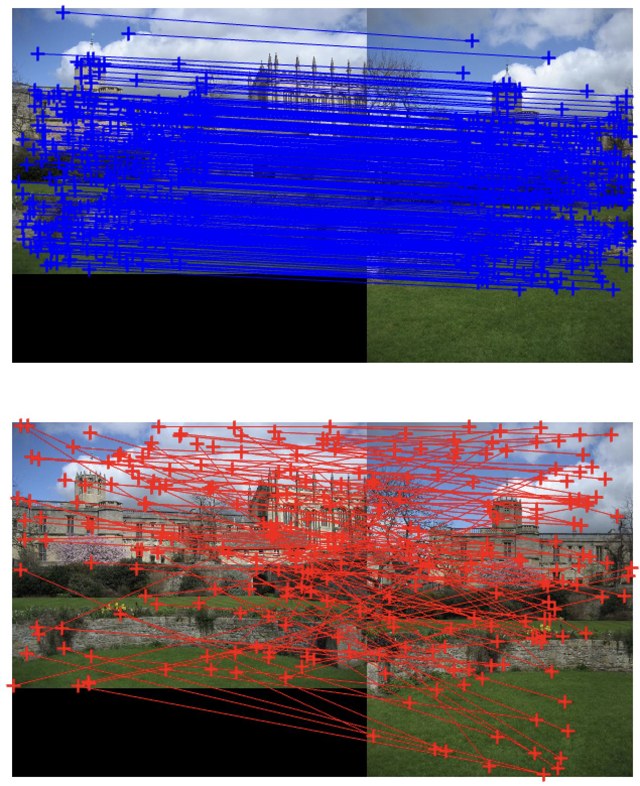
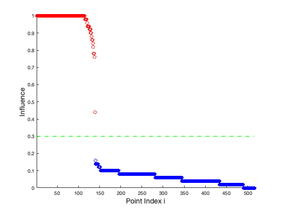

# Quantum Robust Fitting

### [Paper](https://openaccess.thecvf.com/content/ACCV2020/papers/Chin_Quantum_Robust_Fitting_ACCV_2020_paper.pdf) 

[Tat-Jun Chin <sup>1</sup>](), 
[David Suter <sup>2</sup>](), 
[Shin-Fang Chng <sup>1</sup>](), 
[James Quach <sup>3</sup>]().

[<sup>1</sup>  Australian Institute for Machine Learning (AIML), University of Adelaide](https://www.adelaide.edu.au/aiml/), 
[<sup>2</sup>  School of Computing and Security, Edith Cowan University]()
[<sup>3</sup>  School of Physical Sciences, The University of Adelaide]()


### About ###
This is the official repository for Quantum Robust Fitting.

### Getting Started ###
This demo runs in MATLAB, and has been tested on macOS Catalina and Ventura.

### Demo 1: 2D Line Fitting ###
This demo demonstrates an example of computing the ``exact influence`` on the 2D line fitting problem.
1. Run `main.m` in demo_influence folder.

### Demo 2: Homography Estimation ###
This demo demonstrates an example of computing the ``exact influence`` on solving a homography instance for 20 feature correspondences.
1. Run `main.m` in demo_homography_small folder.

### Demo 3: Large-Scale Homography Estimation ###
This demo demonstrates an example of computing the ``approximate influence`` on solving a large-scale homography instance for more than 200 feature correspondences.
1. Run `main.m` in demo_homography_large folder.


### Dependencies ###
- gurobi (https://www.gurobi.com) (optional)


### Reproducibility ###
We provide the results of large-scale homography estimation for a ``church`` instance. If you wish to plot the results, please follow the steps below:
1. Download the results from the following link:
   https://drive.google.com/drive/folders/1_Z5Be2T78u2PQfWPL0_bl1uvUZlCfDMY?usp=sharing
   
   Please note that you will find two results at the provided link: `accv_official.zip` contains the influence corresponding to the results in the paper, and  `run2.zip` contains the influence for a recent run.
2. Place the data in `demo_homography_large/output` directory.
3. Run `evaluate_approx_influence.m`. You will then obtain the following plots, 

   
   


## 👩‍💻 Citation ##
This code is for non-commercial use. If you find our work useful in your research please consider citing our paper:
 
 ```
  @inproceedings{chin2020quantum,
  title={Quantum robust fitting},
  author={Chin, Tat-Jun and Suter, David and Ch'ng, Shin-Fang and Quach, James},
  booktitle={Proceedings of the Asian Conference on Computer Vision},
  year={2020}
  }
````
